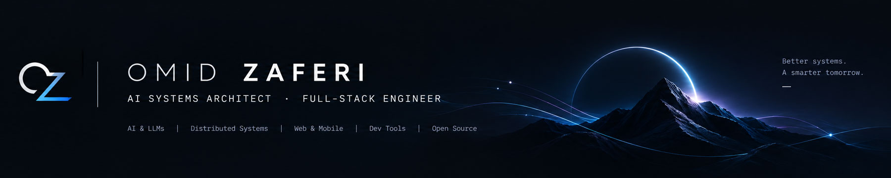

<div align="center">

<!-- SLIM CYBER HERO BANNER -->


<br/>

<!-- DYNAMIC TYPING SVG -->
<a href="https://github.com/omid-io">
  
</a>

<br/>

<!-- CONNECT BADGES -->
[](https://linkedin.com/in/omid-zaferi)
[](https://x.com/omid_io)
[](mailto:omidzaferi@gmail.com)
[](https://github.com/omid-io)

</div>

---

### 📦 Verified Registries & Public Distributions

Production developer tools published to global ecosystem registries:

| Platform / Registry | Package / Extension | Status / Version | Verification |
| :--- | :--- | :---: | :---: |
| **Visual Studio Marketplace** | `omid-io.vibe-ui-vscode` |  | [View in Marketplace](https://marketplace.visualstudio.com/items?itemName=omid-io.vibe-ui-vscode) |
| **Open-VSX Registry** | `omid-io/vibe-ui-vscode` |  | [View in Open-VSX](https://open-vsx.org/extension/omid-io/vibe-ui-vscode) |
| **NPM Registry** | `@omid-io/tokens` |  | [View on NPM](https://www.npmjs.com/package/@omid-io/tokens) |
| **Greasy Fork** | `digikala-pure-search` |  | [View on Greasy Fork](https://greasyfork.org/en/scripts/593664-digikala-pure-search) |
| **Eclipse Foundation** | Eclipse Contributor Agreement |  | Signed Author (`omidio`) |

---

### 🚀 Flagship Engineering Suites

Production-grade architectures designed for scalability, zero-latency workflows, and deep AI-human interfaces:

| Project | Architecture & Highlights | Tech Stack | Proof & Quality |
| :--- | :--- | :--- | :---: |
| [**🎨 Vibe UI Suite**](https://github.com/omid-io/vibe-ui-suite) | **AI-First Front-End Design Compiler & Token Engine.** Features 26 orthogonal style families, zero-latency in-browser web studio, VS Code extension, Next.js 15 starter, and strict WCAG mathematical contrast verification. | `TypeScript` `Next.js 15` `Tailwind v4` `Python` `VS Code API` | [](https://github.com/omid-io/vibe-ui-suite) [](https://omid-io.github.io/vibe-ui-suite/) |
| [**⚡ Google Flow Suite**](https://github.com/omid-io/google-flow-suite) | **Unified CDP & API Generative Suite.** High-throughput automation engine supporting Nano Banana 2 & Omni Flash/Veo 3.1 with SQLite state tracking, 50 golden presets, and asynchronous job queues. | `Python` `FastAPI` `Playwright` `SQLite` `AsyncIO` | [](https://github.com/omid-io/google-flow-suite) [](https://github.com/omid-io/google-flow-suite) |
| [**🛡️ AirTun**](https://github.com/omid-io/AirTun) | **High-Throughput Kernel Networking & Tunneling.** Ultra-fast mobile internet & VPN tunnel sharing for Windows 10/11 using Wintun kernel drivers and local SOCKS5 proxy without Android root. | `C#` `.NET 8` `WinUI 3` `Kotlin` `Wintun` | [](https://github.com/omid-io/AirTun) [](https://github.com/omid-io/AirTun) |
| [**🧹 Digikala Pure Search**](https://github.com/omid-io/digikala-pure-search) | **Real-Time DOM Purification & Anti-Ad Engine.** High-performance mutation observer eliminating sponsored and promoted merchandise across e-commerce feeds. | `JavaScript` `DOM Mutation` `uBlock Origin` `Manifest V3` | [](https://greasyfork.org/en/scripts/593664-digikala-pure-search) |

---

### 🎯 Upstream Open-Source Track Record

Core engineering contributions, memory-safety fixes, and framework patches across Tier-1 global ecosystems:

| Organization / Repository | Domain / Area | Architectural Impact & Solution | Proof & Status |
| :--- | :--- | :--- | :---: |
| [**dotnet / runtime (Microsoft)**](https://github.com/dotnet/runtime) | `AndroidAppBuilder / NativeAOT` | Fixed Roslyn compiler CS9377/CS9389 memory-safety pointer violations in NativeAOT templates | [](https://github.com/dotnet/runtime/pull/134277) |
| [**run-llama / llama_index**](https://github.com/run-llama/llama_index) | `core / tools` | Preserved typed error propagation and `is_error` flag across `FunctionTool` calls | [](https://github.com/run-llama/llama_index/pull/23138) |
| [**NousResearch / hermes-agent**](https://github.com/NousResearch/hermes-agent) | `core / tools / concurrency` | Core shared-memory concurrency salvage by Teknium (`#114862` cherry-picked `#114470`) | [](https://github.com/NousResearch/hermes-agent/pull/114862) |
| [**NousResearch / hermes-agent**](https://github.com/NousResearch/hermes-agent) | `cli / fleet` | Fixed unrecoverable restart lock in agent fleet lifecycle (`fleet_restart_pending`) | [](https://github.com/NousResearch/hermes-agent/pull/116090) |
| [**ghost1372 / HandyControls**](https://github.com/ghost1372/HandyControls) | `Controls / MVVM Architecture` | WindowChrome resize border fix, AdornerElement Null-Safety guard, and collection decoupling | [](https://github.com/ghost1372/HandyControls/pull/248) |
| [**imaNNeo / fl_chart**](https://github.com/imaNNeo/fl_chart) | `BarChart / Flutter Core` | Fixed runtime `LateInitializationError` crash on null data spots | [](https://github.com/imaNNeo/fl_chart/pull/2119) |
| [**shadcn-ui / ui**](https://github.com/shadcn-ui/ui) | `docs / astro` | Standardized RTL architecture documentation and routing resolution | [](https://github.com/shadcn-ui/ui/pull/11803) |

---

### ⚡ Architectural DNA & Core Specs

```yaml
architectural_profile:
  role: "Lead Systems Architect & Autonomous Agent Specialist"
  engineering_philosophy: "Evidence over assumptions • Zero-slop design • Mathematical rigor"
  
core_competencies:
  distributed_systems:
    - "Event-Driven Pipelines & Asynchronous Task Queues"
    - "High-Throughput Kernel Networking (Wintun, TUN/TAP, SOCKS5)"
    - "Database Optimization, Concurrency Locks & Query Profiling"
  autonomous_agents:
    - "Model Context Protocol (MCP) Multi-Server Architectures"
    - "Multi-Agent Orchestration & Cognitive Self-Refining Loops"
    - "Stealth Headless Browser Workers & Circadian Behavioral Physics"
  frontend_engineering:
    - "Design Token Compilers (OKLCH, Radix, Tailwind v4)"
    - "Mathematical Contrast & WCAG 2.2 Strict Compliance"
    - "Production Next.js 15 App Router & React Server Components"
```

---

### 🛠️ Tech Arsenal

<div align="center">

**Languages & Runtimes**  


<br/>

**Infrastructure, Systems & DevOps**  


<br/>

**AI Protocols & Modern Web**  


</div>

---

<div align="center">
<!-- DARK STEALTH FOOTER WAVE -->

</div>